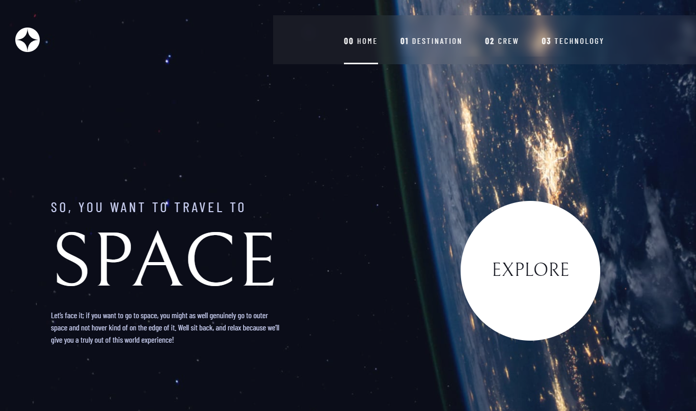
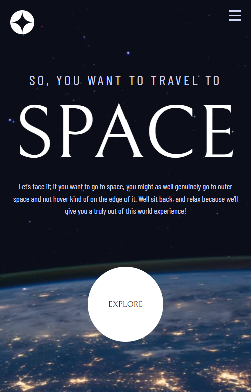

# Frontend Mentor - Space tourism website solution

This is a solution to the [Space tourism website challenge on Frontend Mentor](https://www.frontendmentor.io/challenges/space-tourism-multipage-website-gRWj1URZ3). Frontend Mentor challenges help you improve your coding skills by building realistic projects. 

## Table of contents

- [Overview](#overview)
  - [The challenge](#the-challenge)
  - [Screenshot](#screenshot)
  - [Links](#links)
- [My process](#my-process)
  - [Built with](#built-with)
  - [What I learned](#what-i-learned)
  - [Continued development](#continued-development)
  - [Useful resources](#useful-resources)
- [Author](#author)
- [Acknowledgments](#acknowledgments)

**Note: Delete this note and update the table of contents based on what sections you keep.**

## Overview

### The challenge

Users should be able to:

- View the optimal layout for each of the website's pages depending on their device's screen size
- See hover states for all interactive elements on the page
- View each page and be able to toggle between the tabs to see new information

### Screenshot

### Links

- Solution URL: [https://github.com/Samuel-jacobs/space-tourism](https://github.com/Samuel-jacobs/space-tourism)
- Live Site URL: [https://samuel-jacobs.github.io/space-tourism/](https://samuel-jacobs.github.io/space-tourism/)

## My process

### Built with

- Semantic HTML5 markup
- CSS custom properties
- Flexbox
- Mobile-first workflow
- vanilla javascript

### What I learned

i started adding utility classes to be reused throughout the page. It made things a bit easier. I practiced more on tabs.

### Continued development

i intend to continue exploring css, I want to start using sass in my future projects. I would also try to recreate the project with react when I'm more confident with it.

### Useful resources

- [w3schools.com](https://www.w3schools.com) - This is a great resource when you need to remember a syntax or you're not too sure how to add a functionality or a css property. 

## Author

- Frontend Mentor - [@samueljacobs](https://www.frontendmentor.io/profile/samueljacobs)
- Twitter - [@__samueljacobs__](https://www.twitter.com/_samueljacobs_)

